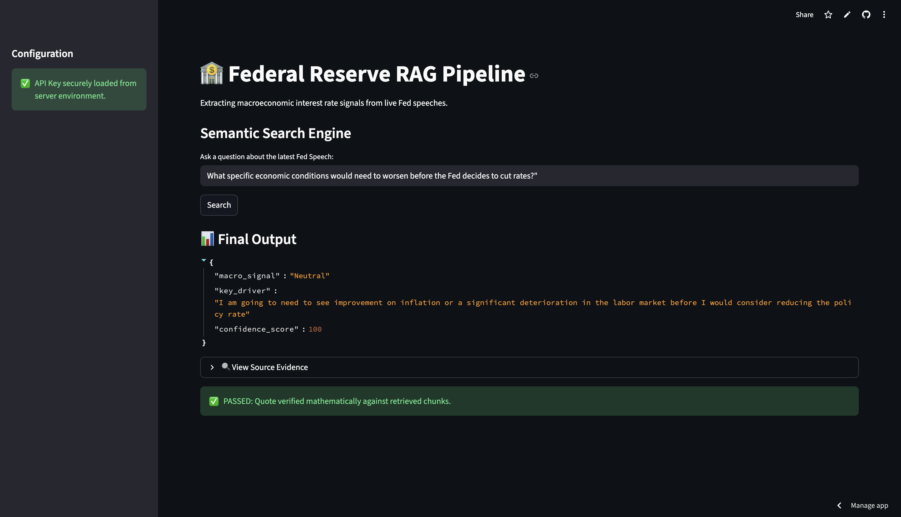

# 🏦 FedRAG Engine: Deterministic Macroeconomic Signal Extraction

**Live Demo:** [Click here to view the live app on Streamlit Cloud](https://ayush5786-fedrag-engine-fed-app-5asgp0.streamlit.app/)

## Overview
The FedRAG Engine is an automated, real-time extraction pipeline designed for quantitative finance. It dynamically scrapes live XML feeds from the U.S. Federal Reserve, builds an in-memory vector database, and utilizes the Groq Llama-3.3 70B model to extract macroeconomic signals (Hawkish, Dovish, Neutral). 

Most importantly, it features a **custom Python Set-Theory safety net** to mathematically detect and prevent LLM hallucinations.

## 🛠️ Architecture & Tech Stack
* **Data Ingestion:** `Feedparser` and `BeautifulSoup4` for live XML RSS parsing and HTML cleaning.
* **Semantic Chunking:** Custom double-newline (`\n\n`) aggregation (max 300 words) to preserve paragraph logic, replacing naïve character-splitting.
* **Vector Database:** `SentenceTransformers` (`all-MiniLM-L6-v2`) and `FAISS` (L2 distance) for localized, in-memory embedding storage.
* **LLM Engine:** `llama-3.3-70b-versatile` running via the **Groq API** for ultra-low latency generation.
* **Frontend UI:** Built dynamically with `Streamlit`, featuring `@st.cache_resource` for database persistence and latency reduction.

## 🛡️ Hallucination Prevention (The Safety Net)
Large Language Models are prone to hallucinating financial quotes. To make this production-ready, I engineered a deterministic validation layer:
1. The LLM extracts the quote and calculates a confidence score based on a strict, universal grading rubric.
2. The Python backend intercepts the quote, strips punctuation, and converts the strings into Sets.
3. A fuzzy-matching intersection calculation is performed between the retrieved FAISS chunks and the LLM's quote.
4. If the overlap is below 90%, the system overrides the LLM, zeroes the confidence score, and throws a hallucination error to the user.

## 🚀 How to Run Locally
1. Clone this repository.
2. Install the requirements: `pip install -r requirements.txt`
3. Run the app: `streamlit run app.py`
4. Enter your personal Groq API key into the secure sidebar widget.
